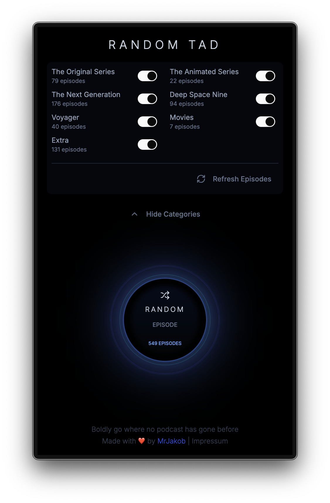

# Random TAD

## About
A Random [Trek am Dienstag](https://trekamdienstag.de) Podcast Episode Selector

<div align="center">
  
</div>

## What?
This is a lightweight web application that loads and parses the RSS feed of
**Trek am Dienstag**, one of my favorite German podcasts. In this show, two
hosts discuss and revisit every episode of classic Star Trek in their original
release order.

While waiting for new episodes to be released, I often want to revisit previous
ones. This app allows you to **randomly** select from their back catalog, with
filtering options by series (TOS, TAS, TNG, Voyager, DS9, etc.).

The tool is live and ready to use at [random-tad.de](https://random-tad.de).

## Acknowledgements
**Thanks Sebastian & Simon for creating such an awesome podcast!**

Without these two "TADerichs," I wouldn't have had a reason to create this
small application, nor would I have been able to revisit my childhood Star Trek
memories in such wonderful detail. Thank you for your dedication to this
project and your other podcast ventures. You're truly amazing!

## Development
This application is built with Next.js framework and styled using Tailwind CSS.

### Installing dependencies
```sh
npm install
```

### Starting a dev server
```sh
npm run dev
```

### Building the project
```sh
npm run build
```

### Starting the production build
```sh
npm start
```
